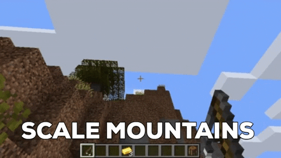

# Grappling Hook

A Grappling Hook plugin based on snowgears' grappling-Hook plugin for older Minecraft.

- /ghook give — gives yourself a grappling hook
- /ghook give <player> — gives another player a grappling hook

- Cast the hook, then reel in to grapple in an arch towards where it lands
- The farther away the hook is, the farther you launch
